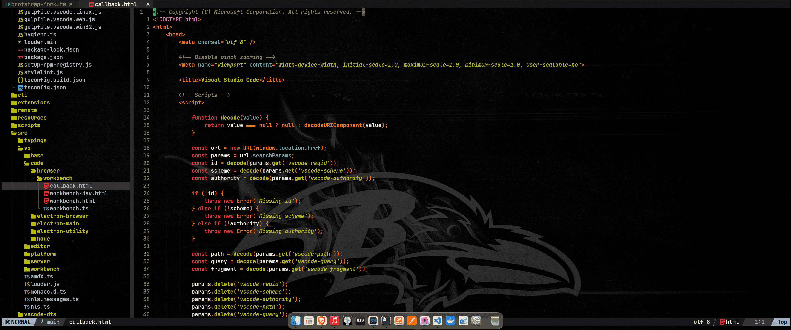

# Wezterm Config

This repo contains my custom Wezterm(terminal of choice ) Terminal config for macOS (Unix/POSIX), Debian/Ubuntu.




## File Structure

```text
├── config.lua
├── events.lua
├── LICENSE
├── README.md
├── wezterm.lua
├── WezTermUI.png
└── WezTermUI2.png
